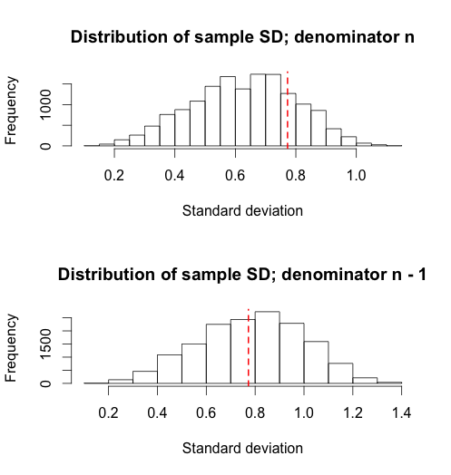

# README

## Introduction
This is just a little R script set up to demonstrate bias introduced by using denominator _n_ rather than _n - 1_ when using sample standard deviation to estimate the population parameter.

The script:

* Generates a random population (of size 20).
* Generates all possible samples (of size 5).
* For each sample, calculates the standard deviation using denominator _n_ and denominator _n - 1_.
* Shows each distribution with the actual population standard deviation marked.

## Example output

